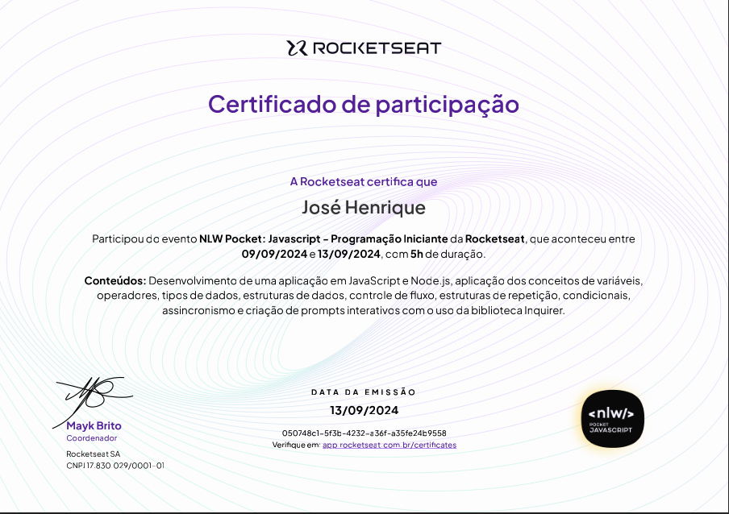
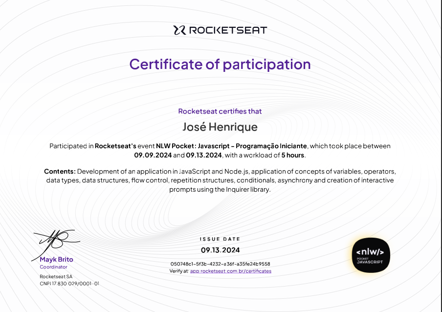

## O que esse programa faz?

- Cria metas;
- Exclui metas;
- Lista metas (metas realizadas e pendentes);
- Marcar e desmarca metas concluidas;
- Persistẽncia de dados;
- Sistema de mensagens.

## Linguagem de programação utilizada

A linguagem escolhida foi o Javascript, sendo facil de aprender e codificar, podendo ser usada tanto no frontend, como no backend.

## Fases da resolução do problema

Coletar os dados
Processar os dados (manipular, alterar ...)
Apresentar os dados

## Peças da linguagem

- Comentários
- Declaração de variáveis (const, let)
- Operadores (atribuição, concatenação, matemáticos, lógicos )
- Tipos de dados (string, number, boolean)
- Estrutura de dados (functions, object, array)
- Controle de fluxo (if/else)
- Estrutura de repetição (for, while)

## Escopo e variáveis

- Variáveis globais e locais
- Constantes

## Tipos de dados

- Strings (texto): "" '' ``
- Numbers: 2 1.4
- Boolean: true, false

## Operadores

- Operadores de atribuição de valor: =
- Operador de contatenação: +
- Operadores de comparação: == != <= >= < >
- Spread operator: ...

## Estruturas de dados

### Arrays 

- Lista que contém qualquer tipo de dado
- Métodos de array: push, [find, forEach, filter, map] : HOF (Higher Order Functions)

### Objetos

- Acesso a propriedades de objetos
- Atributos e métodos
- Criação e manipulação de objetos

### Functions

- Criar, passar argumento
- Excutar
- Arrow function / named function

## Estrutura de repetição

- While

## Condicionais

- Switch
- if/else

## Módulos em Node.js:

- Importação de módulos (require, CommonJS)
- Biblioteca 'inquirer' para criar prompts interativos
- FS (file system)

## JSON

- Javascript Object Notation (.json)
- JSON.parse(): transforma de JSON para JS
- JSON.stringify(): transforma de JS para JSON

## Programação assíncrona e Promises:

- Uso de funções assíncronas (async/await)

## Execução e instalar Dependências

- npm install inquirer
- Executar o projeto: node index.js

## Certificado

- Certificado em Português Brasileiro

- Certificado em Inglês

